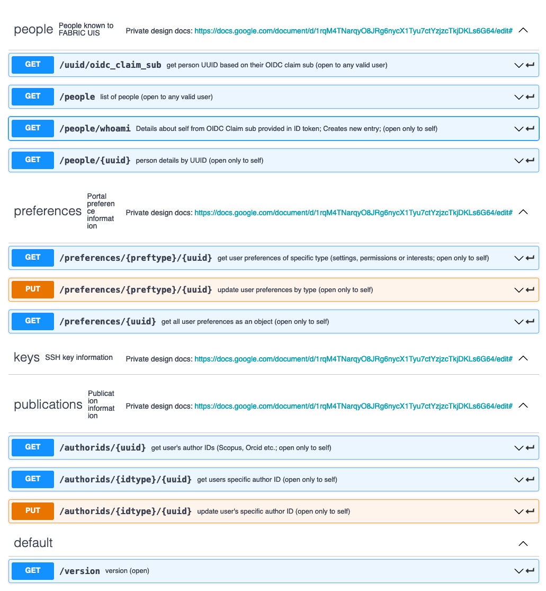

[](https://requires.io/github/fabric-testbed/UserInformationService/requirements/?branch=oidc-claim-sub-no-param)

# User Information Service (UIS)

Python (Flask) RESTful API service for managing FABRIC user information.

# About

UIS manages information about known FABRIC users - their portal preferences, SSH public keys, alternate
identities (ORCID, Web of Science etc), publications etc. Basic information about users comes from 
CILogon/COmanage (name, email etc) while the rest is stored in the associated persistent relational database.

UIS design is modeled after [Project Registry](https://github.com/fabric-testbed/project-registry/blob/master/README.md).
In production the authentication is performed via CILogon/VouchProxy, and much of the information about the user can 
only be retrieved by the user herself. 

UIS is  implemented as a RESTful service using 
[OpenAPI 3.0 (Swagger) definition](https://app.swaggerhub.com/apis/fabric-testbed/user-information-service) and is 
intended to be deployed as a Dockerized Flask application run by `uwsgi` behind dedicated Nginx 
(Sample [Nginx config](nginx)).

# API Specification
 
UIS provides guarded access to user information - portal preferences, publications, SSH keys, alternate IDs and so on.

Most of the API calls allow only the user herself to request her own information and is intended (via
mechanism like [VouchProxy](https://github.com/vouch/vouch-proxy)) to allow a user to authenticate using OIDC via 
a portal application and, once authenticated, for the portal to request the necessary information on 
user behalf.

The initial implementation provides several entrypoints:



There are several entrypoints intended for the portal to store and retrieve different types of preferences on
behalf of the user. These are opaque JSON dictionaries to UIS and are encoded and interpreted 
by the portal logic. Preferences come in three separate flavors: `settings` for portal settings,
`permissions` - for personal information visibility permissions and `interests` - for social interests 
(to enable e.g. to 'follow' projects).
The `/preferences/{uuid}` call returns a Preferences structure:
```
Preferences:
   properties:
     settings:
       type: object
     permissions:
       type: object
     interests:
       type: object
```

# Database

Uses postgres. Schema is defined via ORM under
[server/swagger_server/database/models.py](server/swagger_server/database/models.py)

To connect to the database directly, login to the postgres container:
```bash
$ docker exec -ti uis-database bash
#/ postgres -U postgres -W
postgres-# \dt 
             List of relations
 Schema |      Name      | Type  |  Owner   
--------+----------------+-------+----------
 public | author_ids     | table | postgres
 public | fabric_papers  | table | postgres
 public | fabric_people  | table | postgres
 public | papers_authors | table | postgres
 public | portal_keys    | table | postgres
 public | user_keys      | table | postgres
 public | version        | table | postgres
postgres-# 
```

Read the COmanage section and other sections regarding impact of manipulataing the database by hand.

# COmanage and User Management

UIS talks to COmanage via its REST API to determine if users are active. One important
caveat is if a user originally enrolls, then gets expunged from COmanage - they do not 
automatically get removed from UIS db (although they no longer are not considered) active.
However if they do re-enroll, they get a new internal ID in COmanage that no longer matches
what is in UIS database. In this case operator must manually remove user from UIS database.
After that the user can login to Portal (via UIS) successfully - a new entry will be created
but their preferences are lost.

Alternatively if the new co_person_id is known, UIS database `co_person_id` column can
be updated with the new value for the re-enrolled user.

Details of COmanage API can be found [here](https://spaces.at.internet2.edu/display/COmanage/CoPerson+API).
 
# Testing

Setup your env_template. Then run `docker-compose -f <compose file> --env-file <env file> up`.

Copy and edit [env_template](env_template) to customize env file for specific type of test.  

There are multiple ways to test with different arrangements of containers:
- [Simple 'no-Nginx' setup](docker-compose-nonginx.yml), in which just two dockers are stood up. Typically used for 
basic testing without any authentication. Once the containers are up connect to `http://localhost:5000/ui` to 
interact with the service.
    - API server (under uWSGI)
    - Postgres
- ['Vouch Proxy' local](docker-compose.yml), configured to run on localhost, adds containers for Nginx and VouchProxy. Used for
testing proper authentication with CILogon, albeit from localhost only and using provided [self-signed SSL certs](ssl/). 
Once the containers are up connect to https://127.0.0.1:8443/ui to interact with the service (please not not to use 
`localhost` as that does not work for CI Logon callbacks). 
    - Nginx
    - API Server
    - Vouch Proxy
    - Postgres 
  
## Testing components 

If you don't want to use docker compose, you can start individual Dockers (for postgres and api server) as follows to help test:
```
$ docker run -d --name pgsql -e POSTGRES_PASSWORD=uiservice -e PGDATA=/var/lib/postgresql/data/pgdata -v /some/path/to/persistent/pgsqldata/:/var/lib/postgresql/data -p 5432:5432 postgres
$ docker run -d --name uis -e POSTGRES_HOST=localhost -e POSTGRES_PORT=5432 -e POSTGRES_USER=postgres -e POSTGRES_PASSWORD=uiservice -e SWAGGER_HOST=127.0.0.1 -p 5000:5000 uis
```

Note that API server looks for environment variable `UISERVICE_MOCK` to be set to true to load tables with mock data automatically.

### Testing the database

Start the database docker as shown above. You can then get to `bash` inside of it and run the Posgres client tool 
(you can also do it from outside the container if you have the client installed). Note that since Postgres is started
as listening on a port, the client tool won't connect over a socket even from inside the container.

```
$ psql -h localhost -p 5432 -U postgres
```
Some helpful Postgres commamds: 

- listing schema:
```
select table_name, column_name, data_type from information_schema.columns where table_name = 'fabric_papers';
```
- listing and changing databases
```
\l list databases
\c <db name>
```
- describing tables in a database
```
\dt describe tables
```


# Deployment

Production deployment is meant to mimic the 'Vouch Proxy' local docker deployment discussed above, but updated with
proper secrets, certs etc. You must edit the following files to support a production deployment:
- [nginx/default.conf](vouch/default.conf) - API routing
- [vouch/config_template](vouch/config_template) - Vouch Proxy configuration discussed below
- [env_template](env_template) - environment settings that determine the behavior of docker-compose

To configure Vouch Proxy, copy [vouch/config_template](vouch/config_template) to `vouch/config`, edit at least the 
following parameters:
- `vouch/publicAccess` set to `true` (UIS has to allow unauthenticated access in some cases)
- `jwt/secret` must be changed - if using in production, it likely needs to be the same as on all other services,
e.g. Project Registry
- `cookie/domain` must be set to appropriate domain (127.0.0.1 only works for testing, set it to the domain where the
  application is deployed - in order for cookies to be valid at other applications within the domain)
- `oauth/client_id` and `oauth/client_secret` must match those issued to this service in CI Logon as OIDC client
- `oauth/callback_url` must match the callback URL set in CI Logon

More details on configuring the service with VouchProxy and Nginx for production is contained with 
[Project Registry](https://github.com/fabric-testbed/project-registry) - a similar System Service.

# References

- Swagger: [https://swagger.io](https://swagger.io)
- OpenAPI Specification: [https://swagger.io/docs/specification/about/](https://swagger.io/docs/specification/about/)
- CILogon: [https://www.cilogon.org](https://www.cilogon.org)
- COmanage: [https://www.cilogon.org/comanage](https://www.cilogon.org/comanage)
- VouchProxy: [https://github.com/vouch/vouch-proxy](https://github.com/vouch/vouch-proxy)
